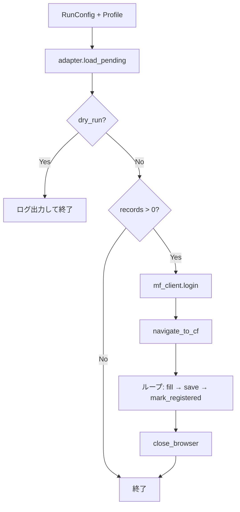

# CSV → マネフォ ME 共通基盤 設計書

## 1. 背景と目的

### 現状

| スクリプト | 実装 | 差分 |
|---|---|---|
| `iccard2mf.py` | CSV 読み込み + MF 手入力モーダル操作 + CLI をすべて内包 | デフォルト口座 `SUGOCA` |
| `onebank2mf.py` | `iccard2mf` を import する薄いラッパー | デフォルト口座 `ワンバンク` |

両者は **同一 CSV スキーマ**（`利用日, 利用内容, 利用金額, 大分類, 小分類, マネフォ登録日`）と **同一 MF UI 操作**（家計簿 → 手入力モーダル）を共有している。口座名（支出元 / 入金先）は実行時引数 `--account` で既に差し替え可能だが、コード上は `ICRecord` など IC カード固有の命名が残り、新ソース追加のたびにラッパーを増やすか `iccard2mf` に依存する形になる。

### 目的

- **支出元・入金先（口座名）に依存しない** CSV → MF 登録パイプラインを共通化する
- **既存スクリプトは変更しない**（後方互換）
- 新ディレクトリ `csv2mf/` でリファクタを開始し、段階的に移行できる構成にする

### 非目的（初期スコープ外）

- `anapay2mf_icloud-mail.py` のスプレッドシート連携・カンタン入力 UI への統合
- 既存 `iccard2mf.py` / `onebank2mf.py` の削除や挙動変更
- CSV 生成（OCR プロンプト等）の共通化

---

## 2. 設計方針

1. **ドメインモデルはソース非依存** — `TransactionRecord` として定義し、`ICRecord` はラッパー期間のみ alias
2. **I/O と MF 操作を分離** — CSV 読み書きと Selenium 操作は独立モジュール
3. **Profile で差分を閉じ込める** — 口座デフォルト・CLI 説明文など「ソース固有の設定」だけを Profile に集約
4. **Adapter で CSV スキーマを差し替え可能に** — 現行は 1 実装（MF 共通スキーマ）のみ、将来拡張のフックを用意
5. **Pipeline がオーケストレーション** — load → register loop → mark の流れを 1 箇所に集約
6. **既存は import 委譲で段階移行** — 新基盤が安定したら既存スクリプトを薄いエントリに差し替え（任意）

---

## 3. レイヤ構成

```
┌─────────────────────────────────────────────────────────┐
│  Entry Points (既存維持 / 将来 csv2mf/cli 経由)          │
│  iccard2mf.py  onebank2mf.py  csv2mf/__main__.py        │
└──────────────────────────┬──────────────────────────────┘
                           │
┌──────────────────────────▼──────────────────────────────┐
│  Pipeline (csv2mf/pipeline.py)                          │
│  run(csv_path, adapter, mf_client, account, limit)      │
└───────┬──────────────────────────────┬──────────────────┘
        │                              │
┌───────▼──────────┐         ┌─────────▼─────────────────┐
│  CsvAdapter      │         │  MfManualEntryClient      │
│  load_pending()  │         │  login / fill / save      │
│  mark_done()     │         │  (Selenium + Helium)      │
└───────┬──────────┘         └───────────────────────────┘
        │
┌───────▼──────────┐
│  MfSpecCsvAdapter│  ← 現行スキーマ（IC/ワンバンク共通）
│  (将来: 他Adapter)│
└──────────────────┘
```

---

## 4. ディレクトリ構成

```
anapay2moneyforward/
├── iccard2mf.py              # 既存（変更なし → 将来 import 委譲可）
├── onebank2mf.py             # 既存（変更なし）
├── csv2mf/                   # ★ 新規パッケージ
│   ├── __init__.py
│   ├── models.py             # TransactionRecord, RunConfig
│   ├── pipeline.py           # run(), dry_run_log()
│   ├── cli.py                # 共通 argparse ビルダー
│   ├── csv/
│   │   ├── __init__.py
│   │   ├── io.py             # エンコーディングフォールバック読み書き
│   │   ├── parse.py          # 日付・金額パース
│   │   └── mf_spec.py        # MfSpecCsvAdapter（現行6列スキーマ）
│   ├── mf/
│   │   ├── __init__.py
│   │   ├── auth.py           # login_mf, navigate_to_cf
│   │   └── manual_entry.py   # 手入力モーダル操作
│   └── profiles/
│       ├── __init__.py
│       ├── base.py           # SourceProfile データクラス
│       ├── iccard.py
│       └── onebank.py
├── docs/csv2mf/
│   └── design.md             # 本ドキュメント
└── ...
```

### エントリポイント（移行フェーズ）

| フェーズ | 実行方法 |
|---|---|
| Phase 0（現状） | `python iccard2mf.py ...` / `python onebank2mf.py ...` |
| Phase 1 | `python -m csv2mf --profile iccard ...` を追加。既存はそのまま |
| Phase 2（任意） | 既存スクリプト内部を `csv2mf.pipeline.run` へ委譲 |

---

## 5. ドメインモデル

### 5.1 `TransactionRecord`

IC カード固有名称を排した、MF 手入力モーダルへの入力単位。

```python
@dataclass
class TransactionRecord:
    row_index: int              # CSV データ行の 0-based index（書き戻し用）
    transaction_date: date      # 利用日
    description: str            # 利用内容 → MF「内容」
    amount: int                 # 利用金額（円、正の整数）
    large_category: str         # 大分類（空可）
    small_category: str         # 小分類（空可）

    @property
    def is_income(self) -> bool:
        return self.large_category == "収入"
```

| 旧 (`ICRecord`) | 新 (`TransactionRecord`) |
|---|---|
| `use_date` | `transaction_date` |
| `description` | `description`（同一） |
| `amount` | `amount`（同一） |
| `large_category` | `large_category`（同一） |
| `small_category` | `small_category`（同一） |
| `mf_registered_at` | Adapter 側の関心事（Record には持たない） |

`mf_registered_at` を Record から外す理由: 未登録行だけが Pipeline に流れる。登録済みフラグの表現（列名・型）は Adapter が担当する。

### 5.2 `RunConfig`

1 回の実行設定。

```python
@dataclass
class RunConfig:
    csv_path: Path
    account_name: str           # MF の支出元 / 入金先（口座名 prefix マッチ）
    limit: int = 100
    dry_run: bool = False
```

口座名は **ソースに紐づけず** RunConfig の必須パラメータ。Profile はデフォルト値のみ提供する。

### 5.3 `SourceProfile`

CLI・デフォルト設定の束。

```python
@dataclass(frozen=True)
class SourceProfile:
    name: str                   # "iccard" | "onebank" | ...
    display_name: str           # CLI ヘルプ用 "IC card" | "One Bank"
    default_account: str        # SUGOCA | ワンバンク
    account_env_var: str        # MF_ACCOUNT_NAME | ONEBANK_MF_ACCOUNT_NAME
```

Profile は **ビジネスロジックを持たない**。Adapter や MF Client を差し替える必要が出たときだけ `csv_adapter_factory` 等を Profile に追加する（初期は全 Profile が `MfSpecCsvAdapter` を共用）。

---

## 6. CsvAdapter インターフェース

```python
class CsvAdapter(Protocol):
    def load_pending(self, csv_path: Path, *, limit: int) -> list[TransactionRecord]:
        """未登録行のみ、先頭から最大 limit 件"""

    def mark_registered(
        self,
        csv_path: Path,
        row_index: int,
        registered_at: date,
    ) -> None:
        """1件登録成功ごとに永続化（atomic write）"""
```

### 6.1 `MfSpecCsvAdapter`（初期実装）

現行 `iccard2mf.load_records` / `mark_registered` のロジックをそのまま移植。

| 項目 | 仕様 |
|---|---|
| 必須列 | `利用日`, `利用内容`, `利用金額`, `大分類`, `小分類`, `マネフォ登録日` |
| 未処理判定 | `マネフォ登録日` が空 |
| 収入判定 | `大分類 == "収入"` |
| スキップ条件 | 日付・金額・内容欠落、金額 0 |
| 書き戻し | 一時ファイル + `os.replace`（既存と同一） |
| エンコーディング | `utf-8-sig` → `utf-8` フォールバック |

### 6.2 将来の Adapter 例

| Adapter | 用途 |
|---|---|
| `MfSpecCsvAdapter` | 現行 IC / ワンバンク |
| `ColumnMappedAdapter` | 列名マッピング設定で任意 CSV を受け付け |
| `InMemoryAdapter` | テスト用 |

---

## 7. MF 操作 (`MfManualEntryClient`)

`iccard2mf.py` の Selenium 操作群をクラスまたはモジュール関数に集約。口座名はメソッド引数で受け取り、**ハードコードしない**。

```python
class MfManualEntryClient:
    def login(self) -> None: ...
    def navigate_to_cf(self) -> None: ...
    def open_manual_entry_modal(self, *, is_first: bool) -> None: ...
    def fill_record(self, record: TransactionRecord, *, account_name: str) -> None: ...
    def save_and_wait(self) -> None: ...
    def continue_or_close(self, *, has_more: bool) -> None: ...
    def close_browser(self) -> None: ...
```

### 7.1 `fill_record` の MF マッピング（ソース非依存）

| TransactionRecord | MF 手入力モーダル |
|---|---|
| `is_income == False` | 支出タブ (`input.minus-payment`) |
| `is_income == True` | 収入タブ (`input.plus-payment`) |
| `transaction_date` | `#updated-at` |
| `amount` | `#appendedPrependedInput` |
| `account_name`（RunConfig） | `#user_asset_act_sub_account_id_hash`（prefix マッチ） |
| `large_category` + `small_category` | 大 / 小分類ドロップダウン（見つからなければ warning のみ） |
| `description` | `#js-content-field` |

環境変数 `MF_EMAIL`, `MF_PASSWORD`, `MF_LOGIN_URL`, `MF_CF_URL` は `mf/auth.py` で読み込み（既存と同一）。

### 7.2 将来の MF Backend

ANA Pay 用カンタン入力 UI は別 Backend として切り出す余地を残す。

```python
class MfEntryBackend(Protocol):
    def register_batch(
        self,
        records: list[TransactionRecord],
        *,
        account_name: str,
        on_success: Callable[[TransactionRecord], None],
    ) -> int: ...
```

初期実装は `MfManualEntryClient` のみ。Protocol は docstring / 型ヒントレベルで先行定義してもよい。

---

## 8. Pipeline

```python
def run(
    config: RunConfig,
    *,
    adapter: CsvAdapter,
    mf_client: MfManualEntryClient | None = None,
) -> int:
    records = adapter.load_pending(config.csv_path, limit=config.limit)
    if config.dry_run:
        dry_run_log(records)
        return 0
    if not records:
        logging.info("No pending records to process")
        return 0

    client = mf_client or MfManualEntryClient()
    today = date.today()
    added = 0

    client.login()
    client.navigate_to_cf()

    for idx, record in enumerate(records):
        client.open_manual_entry_modal(is_first=(idx == 0))
        client.fill_record(record, account_name=config.account_name)
        client.save_and_wait()
        adapter.mark_registered(config.csv_path, record.row_index, today)
        added += 1
        client.continue_or_close(has_more=(idx < len(records) - 1))

    client.close_browser()
    return added
```

### 8.1 登録フロー（既存仕様を維持）



**1 件成功ごとに CSV 更新** — 途中中断時の再実行安全性は既存と同一。

---

## 9. CLI 設計

### 9.1 共通 CLI（`csv2mf/cli.py`）

```bash
# Profile 指定（推奨）
python -m csv2mf --profile iccard path/to/history.csv
python -m csv2mf --profile onebank path/to/history.csv

# 口座名を明示（Profile のデフォルトを上書き）
python -m csv2mf --profile iccard path/to/history.csv --account SUGOCA

# 共通オプション
python -m csv2mf --profile onebank path/to/history.csv --limit 50 --dry-run
```

| 引数 | 説明 |
|---|---|
| `csv_path` | 入力 CSV（必須） |
| `--profile` | `iccard` / `onebank`（必須） |
| `--account` | 支出元 / 入金先。未指定時は Profile の `default_account`、さらに env で上書き可 |
| `--limit` | 1 回の最大件数（default: 100） |
| `--dry-run` | CSV 読み込みのみ |

### 9.2 口座名の解決順序

```
CLI --account  >  環境変数 (Profile.account_env_var)  >  Profile.default_account
```

例（ワンバンク）:

1. `--account カスタム口座`
2. `ONEBANK_MF_ACCOUNT_NAME`
3. `"ワンバンク"`

---

## 10. Profile 定義

```python
# csv2mf/profiles/iccard.py
ICCARD = SourceProfile(
    name="iccard",
    display_name="IC card (SUGOCA)",
    default_account="SUGOCA",
    account_env_var="MF_ACCOUNT_NAME",
)

# csv2mf/profiles/onebank.py
ONEBANK = SourceProfile(
    name="onebank",
    display_name="One Bank",
    default_account="ワンバンク",
    account_env_var="ONEBANK_MF_ACCOUNT_NAME",
)
```

新ソース追加手順:

1. CSV が現行スキーマなら Profile を 1 ファイル追加するだけ
2. CSV スキーマが異なるなら Adapter を追加し Profile から参照

---

## 11. 後方互換と移行計画

### Phase 1: 新パッケージ追加（既存無変更）

- `csv2mf/` を実装
- `python -m csv2mf` で新 CLI を提供
- 既存 `iccard2mf.py` / `onebank2mf.py` は触らない
- 単体テストは `csv2mf/` 配下に追加（CSV パース中心）

### Phase 2: 動作同等性確認

- 同一 CSV に対し `--dry-run` 出力が既存と一致することを確認
- 実 MF 登録は少量データで手動 smoke test

### Phase 3: 既存スクリプトの委譲（任意）

```python
# iccard2mf.py（将来案 — ユーザーが移行を選んだ場合のみ）
from csv2mf.pipeline import run
from csv2mf.profiles.iccard import ICCARD
# ... 既存 parse_args の CLI 互換を維持しつつ run() を呼ぶ
```

- CLI 引数名・デフォルト値は **完全互換**
- import パスが変わるだけで利用者体験は同一

### Phase 4: ドキュメント更新

- README に `csv2mf` セクション追加
- `docs/ic-card/` は IC カード固有（OCR 等）として維持

---

## 12. テスト方針

| レイヤ | テスト内容 | MF 接続 |
|---|---|---|
| `csv/parse.py` | 日付・金額パース | 不要 |
| `csv/mf_spec.py` | 未登録フィルタ、収入判定、limit、スキップ | 不要 |
| `csv/mf_spec.py` | `mark_registered` の atomic write | 不要（tmp CSV） |
| `pipeline.py` | dry_run、空 CSV、モック client | 不要 |
| `mf/manual_entry.py` | — | 手動 smoke のみ |

```python
# pipeline テスト例
def test_run_calls_mark_on_success(tmp_path, mock_mf_client):
    ...
    added = run(config, adapter=adapter, mf_client=mock_mf_client)
    assert added == 1
    assert "2026/06/07" in read_csv(tmp_path / "test.csv")[1][5]
```

---

## 13. 新ソース追加チェックリスト

CSV が MF 共通スキーマ（6 列）の場合:

- [ ] `csv2mf/profiles/<name>.py` に `SourceProfile` を追加
- [ ] `profiles/__init__.py` の registry に登録
- [ ] README / 必要なら OCR プロンプト doc を追加
- [ ] サンプル CSV を `data/` に置く

CSV スキーマが異なる場合:

- [ ] `CsvAdapter` 実装を `csv2mf/csv/` に追加
- [ ] Profile に adapter 参照を追加
- [ ] パース・mark の単体テストを追加

---

## 14. リスクと対策

| リスク | 対策 |
|---|---|
| 既存と新実装の挙動差分 | Phase 2 で dry-run 出力比較。委譲前に golden test |
| Selenium の UI 変更 | MF 操作は `mf/` に集約。セレクタ変更は 1 箇所 |
| 二重メンテ（旧 + 新） | Phase 3 委譲までの期間を短く。README で推奨パスを明示 |
| `ICRecord` への外部依存 | 委譲期間中 `iccard2mf.ICRecord = TransactionRecord` alias を提供可 |

---

## 15. まとめ

| 概念 | 責務 |
|---|---|
| `TransactionRecord` | MF に入力する 1 取引（ソース非依存） |
| `RunConfig` | 口座名・limit・dry_run 等の実行パラメータ |
| `SourceProfile` | デフォルト口座・env 名・CLI メタ情報 |
| `CsvAdapter` | CSV ↔ Record、登録済みフラグ管理 |
| `MfManualEntryClient` | MF ブラウザ操作 |
| `pipeline.run` | 全体オーケストレーション |

**口座名（支出元 / 入金先）は Profile の属性ではなく RunConfig のパラメータ** として扱う。Profile は「このソースを使うときのデフォルト口座はこれ」という preset に留める。これにより IC / ワンバンク / 将来のクレカ等を同一 Pipeline で処理できる。
